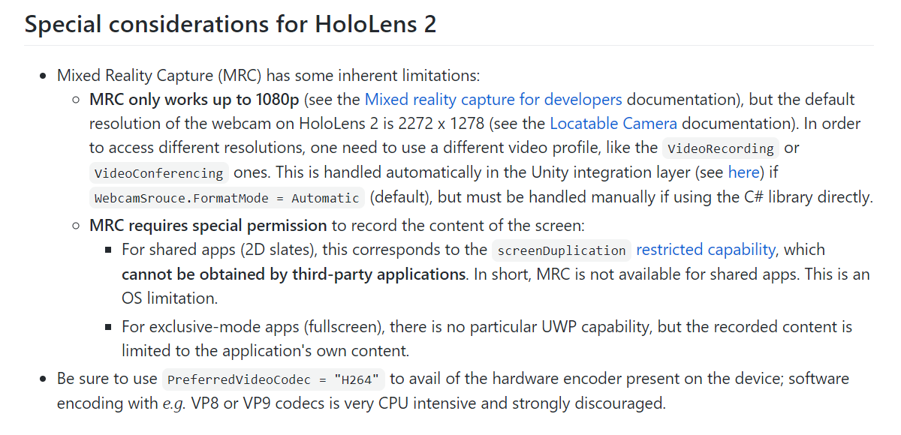
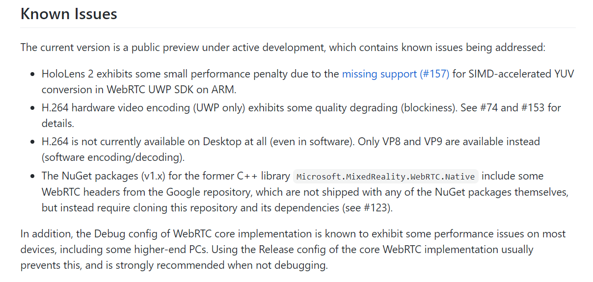

[toc]

## 方案制定

#### 传输协议上确定使用rtc 

- 数据量很大，7000000Bytes, socket + 静态压缩 fps达不到连续
- 必须使用rtc方式的 **有损压缩**
- 使用webrtc实现版版rtc
	- unity官方支持
	- unity官方包已经支持到vp9，av1版正在更

#### rtc的实现版本上的选择

- because-why-not版的，**UWP架构不支持**
- unity-official-webrtc
	- 测试uwp上可以用
	- 但是，资料不全，代码完全没有注释，源码也不公开
- hololence自带的MixedReality-WebRTC
	- M71
		- vp9
	- MixedReality-WebRTC is currently available for Windows 10 Desktop and UWP, with or without Unity, and Android (Unity only).

## hololence自带的MixedReality-WebRTC

- 总工程地址

[官方说明文档](https://microsoft.github.io/MixedReality-WebRTC/)

[C#例子]()

[用户手册](https://microsoft.github.io/MixedReality-WebRTC/manual/introduction)
[API参考](https://microsoft.github.io/MixedReality-WebRTC/api/Microsoft.MixedReality.WebRTC.html)

- 两种方式的下载

[NuGet版]()

[UPM(unity版]()

[google开放的webrtc C++实现](https://opensource.google/projects/webrtc)

### 目前Hololence2上的一些问题

